# DevOps Homework 1 - Winter 2026

**Student:** César Núñez  
**Date:** 01/12/2026

---

## Exercise 1: Git Basics and Configuration

## Deliverables
- Screenshot of `git config --list --global` output: 
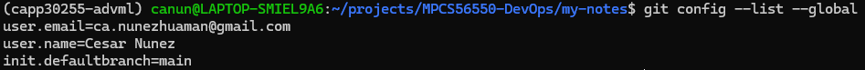
- Screenshot of `git status` showing ignored files and `git log --oneline` output: 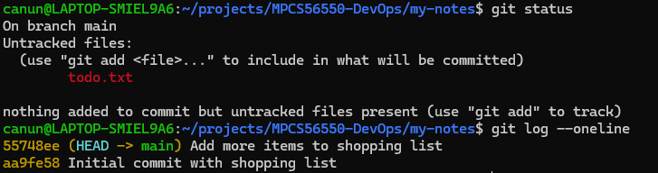

---

## Exercise 2: Git Branches

### Deliverables
- Screenshot of final `notes.txt` file showing both work and personal notes merged together: 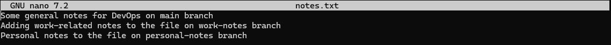
- Screenshot of `git log --graph --oneline` showing the branch history and merge commits: 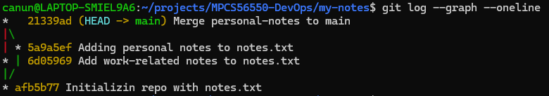
- Screenshot of conflict resolution process (if conflicts occurred during merge): 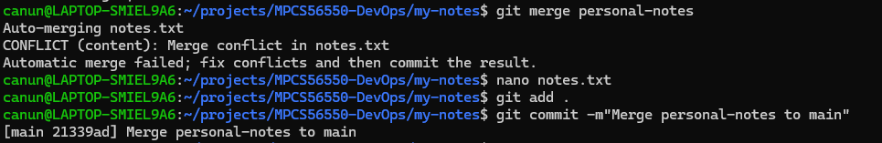
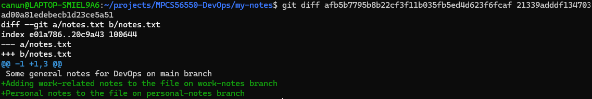

---

## Exercise 3: Git Revision and History

### Deliverables
- Screenshots showing the `git log` and one example of each undo operation: 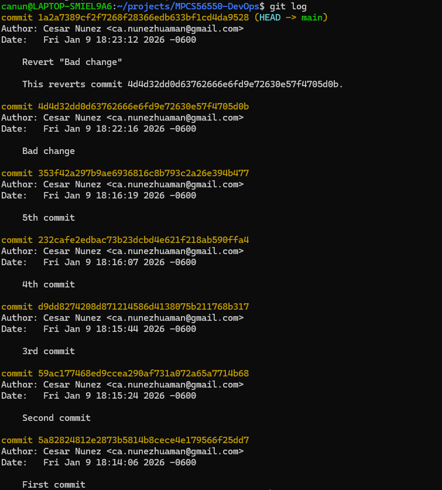
- Before and after screenshots of `git reset --soft` showing changes moved to staging area: 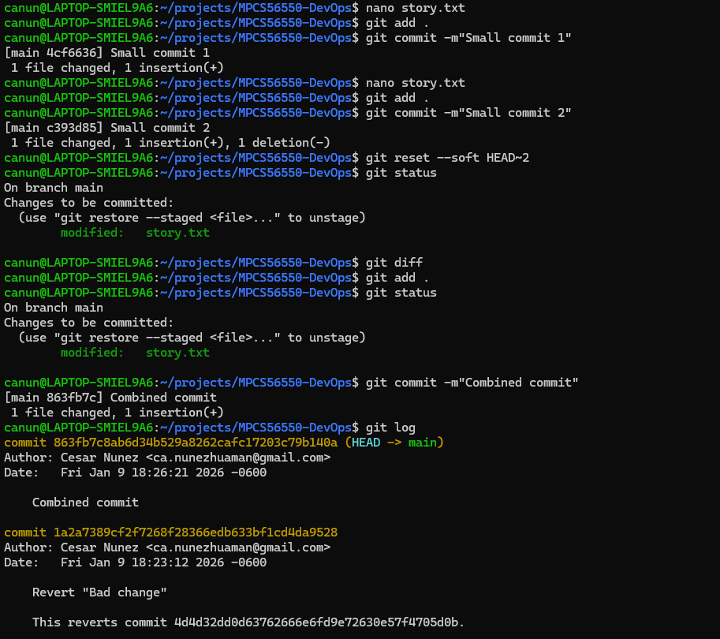 
- Before and after screenshots of `git reset --hard` showing commits completely removed: 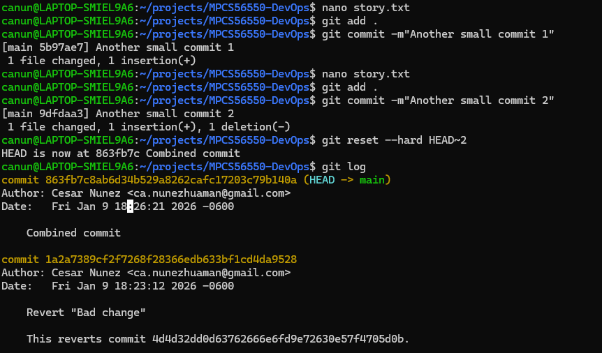 
- Screenshot of `git reflog` showing the reset operations: 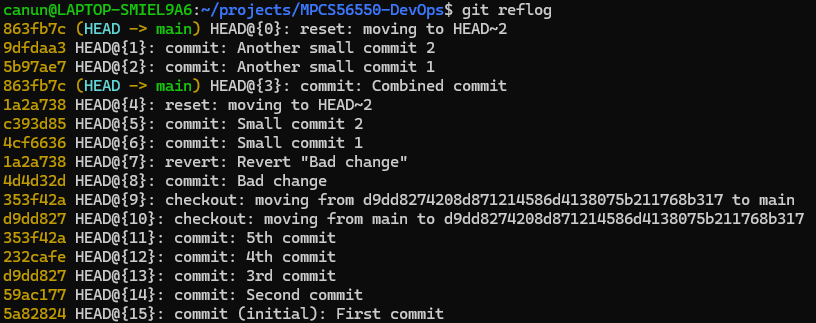 

---

## Exercise 4: Git Hooks

### Note: I used ChatGPT for this exercise since I'm not proficient with bash scripts. An example of the prompt I used:
```
Give me a git hook script that:
 - Checks if any .txt files are empty and warns the user 
 = Prevents commits if the commit would include files with "FIXME" in them
```

### Deliverables
- Hook `pre-commit` script: 
```bash
#!/usr/bin/env bash
set -euo pipefail

# Get staged files (Added/Copied/Modified/Renamed)
staged_files=$(git diff --cached --name-only --diff-filter=ACMR)

# Track whether we should block the commit
block_commit=0

# 1) Warn if any staged .txt files are empty (empty in the index)
while IFS= read -r f; do
  [[ -z "$f" ]] && continue
  [[ "$f" != *.txt ]] && continue

  # If file is deleted or doesn't exist in index, skip
  if ! git cat-file -e ":$f" 2>/dev/null; then
    continue
  fi

  # Size (in bytes) of staged version
  size=$(git cat-file -s ":$f")
  if [[ "$size" -eq 0 ]]; then
    echo "WARNING: Staged text file is empty: $f"
    echo "         (Commit allowed, but you may want to add content.)"
  fi
done <<< "$staged_files"

# 2) Block commit if any staged file contains "FIXME" (in staged content)
while IFS= read -r f; do
  [[ -z "$f" ]] && continue

  # Skip binary files and files not present in index
  if ! git cat-file -e ":$f" 2>/dev/null; then
    continue
  fi

  # Search staged content for FIXME
  if git show ":$f" | grep -n "FIXME" >/dev/null 2>&1; then
    echo "ERROR: Commit blocked. Found 'FIXME' in staged file: $f"
    echo "       Remove 'FIXME' before committing."
    block_commit=1
  fi
done <<< "$staged_files"

if [[ "$block_commit" -ne 0 ]]; then
  exit 1
fi

exit 0
```

- Hook `commit-msg` script: 
```bash
#!/usr/bin/env bash
set -euo pipefail

msg_file="${1:-}"
if [[ -z "$msg_file" || ! -f "$msg_file" ]]; then
  echo "ERROR: commit-msg hook did not receive a valid commit message file."
  exit 1
fi

# Use first non-empty, non-comment line as the "subject"
subject="$(grep -v '^[[:space:]]*#' "$msg_file" | sed '/^[[:space:]]*$/d' | head -n 1 || true)"

if [[ -z "$subject" ]]; then
  echo "ERROR: Commit message is empty."
  exit 1
fi

# 1) At least 5 words
word_count=$(printf "%s" "$subject" | awk '{print NF}')
if [[ "$word_count" -lt 5 ]]; then
  echo "ERROR: Commit message must be at least 5 words."
  echo "       Got $word_count word(s): \"$subject\""
  exit 1
fi

# 2) Reject all-uppercase messages
# Strip everything except letters and spaces, then compare to uppercase version.
letters_only="$(printf "%s" "$subject" | tr -cd '[:alpha:][:space:]')"
letters_only_no_space="$(printf "%s" "$letters_only" | tr -d '[:space:]')"

if [[ -n "$letters_only_no_space" ]]; then
  upper="$(printf "%s" "$letters_only" | tr '[:lower:]' '[:upper:]')"
  if [[ "$letters_only" == "$upper" ]]; then
    echo "ERROR: Commit message cannot be ALL UPPERCASE."
    echo "       \"$subject\""
    exit 1
  fi
fi

exit 0
```

- Hook `post-commit` script: 
```bash
#!/usr/bin/env bash
set -euo pipefail

# Where to write history (repo root)
repo_root="$(git rev-parse --show-toplevel)"
history_file="$repo_root/commit-history.txt"

timestamp="$(date '+%Y-%m-%d %H:%M:%S')"
msg="$(git log -1 --pretty=%B | tr '\n' ' ' | sed 's/[[:space:]]\+/ /g' | sed 's/[[:space:]]*$//')"
hash="$(git rev-parse --short HEAD)"

echo "[$timestamp] ($hash) $msg" >> "$history_file"
```

- Screenshot: 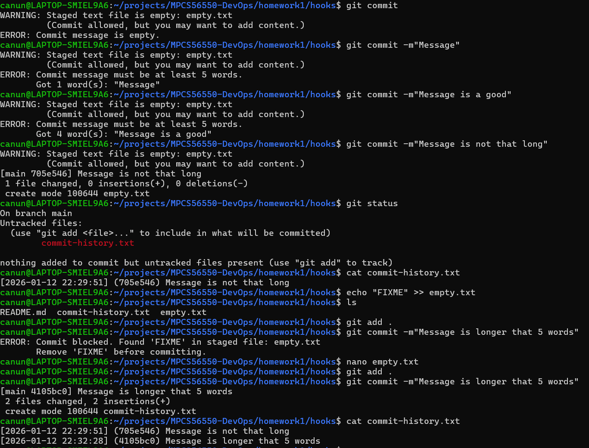

---

## Exercise 5: Remote Repositories and Branches

### Deliverables
- Screenshot of `git remote -v` output: 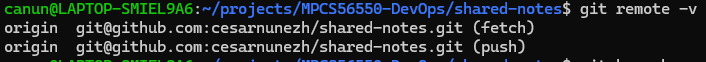 
- Screenshot of `git log --oneline --graph --all` showing local and remote branches: 
- Screenshot of your remote repository on GitHub/GitLab showing the commit history

---

## Exercise 6: Git Stashing

### Deliverables
- Screenshot of `git stash list` showing multiple stashes with descriptive messages: 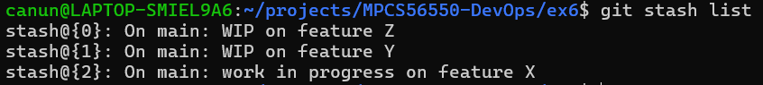 
- Before and after screenshots showing `git status` when stashing and popping changes: 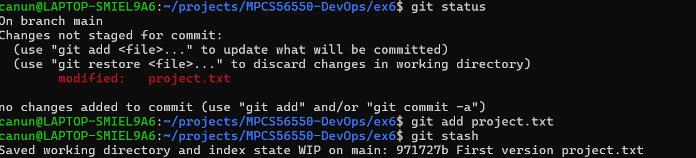 
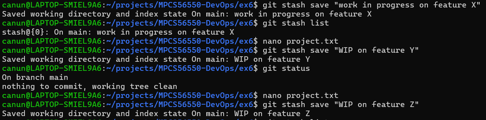 
- Screenshot demonstrating successful branch switching with stashed changes:  
- Example of applying a specific stash from the stash list: 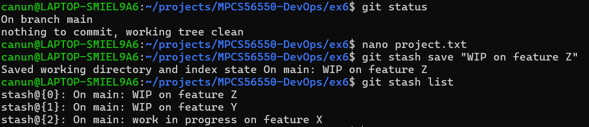 

---

## Exercise 7: Git Tags and Releases

### Deliverables
- Screenshot of `git tag -l` showing all created tags: 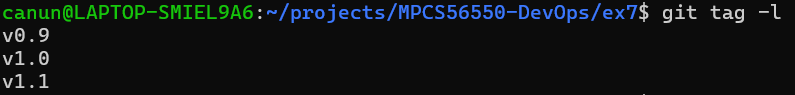 
- Screenshot of `git show v1.1` displaying annotated tag information: 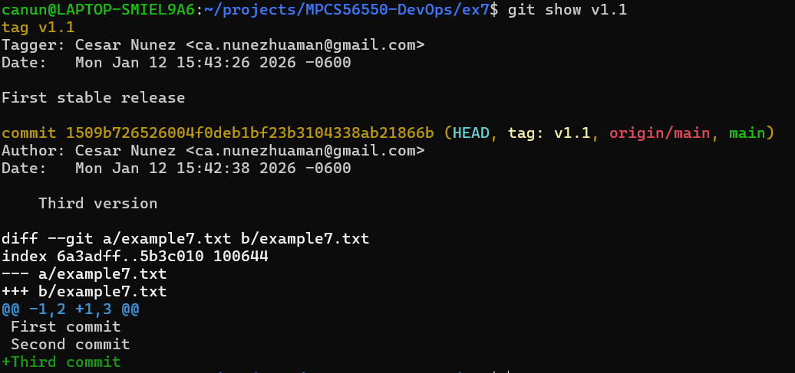 
- Screenshot of repository state when checked out at a specific tag: 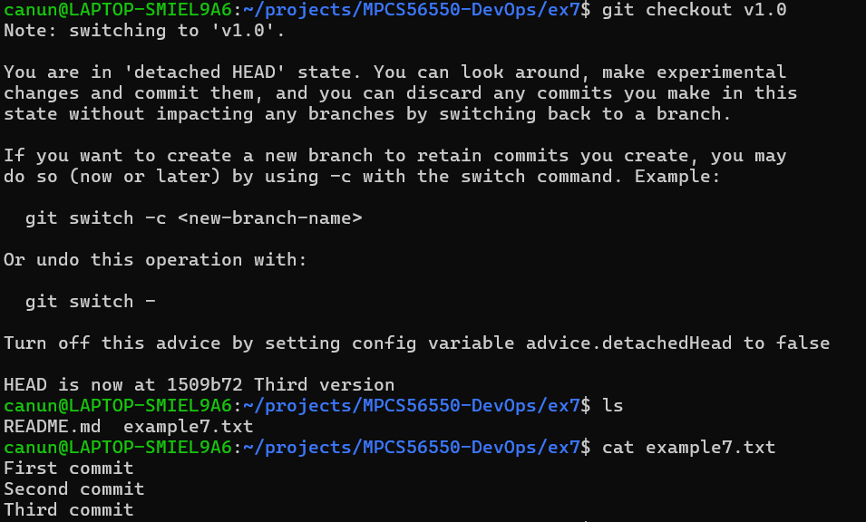 
- Before and after screenshots of deleting tags (showing `git tag -l output`): 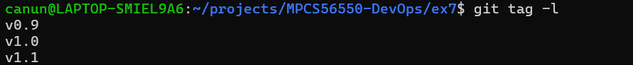 
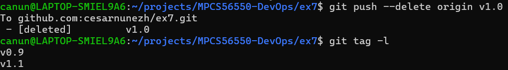 
- Screenshot of remote repository showing pushed tags: 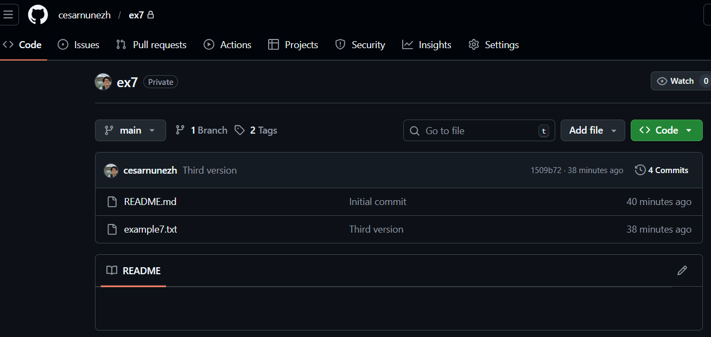 
- Documentation explaining the difference between lightweight and annotated tags: 
```
A lightweight tag does not create a description of the tag, while the annotated tag have information about the user that created the tag, the date when the tag was created and the description of the tag. A lightweight tag only relies on the documentation of the last commit before the creation of the tag. Annotated tags should be used for releasing the application/project while lightweight tags should be used for private or internal presentations.
Source: https://git-scm.com/docs/git-tag
``` 

---

## Exercise 8: Advanced Merging Strategies

### Deliverables
- Screenshot of `git log --graph --oneline --all` showing different merge strategies:  
- Examples of successful cherry-pick operations with `git log` showing the picked commits: 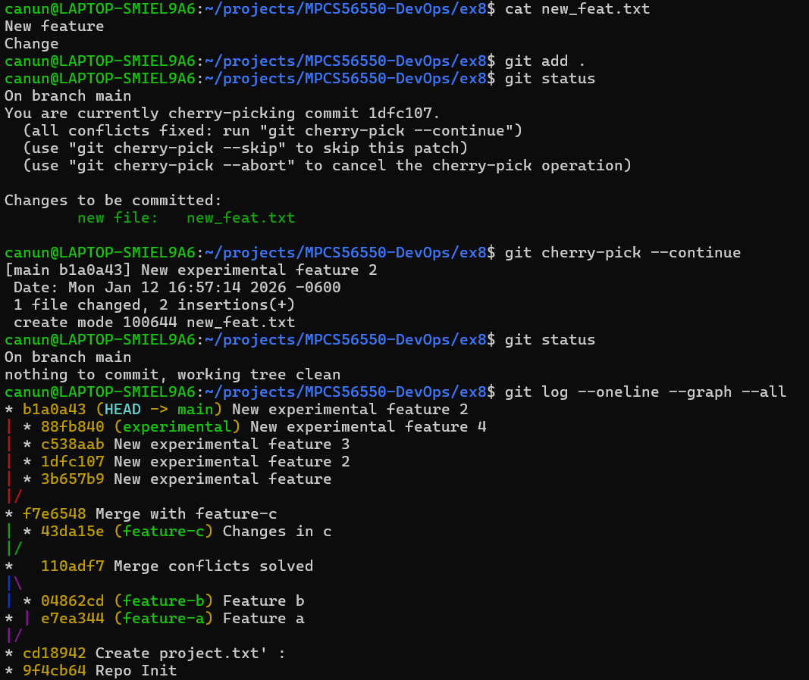 
- Explanation to show when to use merge vs rebase vs cherry-pick: 

    When to use `merge`: when you want to bring changes from one branch into another while preserving the fact that the changes happended on another branch. Git will create a merge commit and the history will show where branches diverged and came back together. This is usually used for integrating finished features branches into main. 

    When to use `rebase`: when you want a unique clean and linear history by replaying your branch's commits on top of another base branch. Rebase does not create a merge commit and keeps individual commits but with different hashes. It's more useful for local or private branches.

    When to use `cherry-pick`: when you want bring specific commits from one branch onto another without mergin the whole branch. This is useful if you have only some commits that are ready, while the rest of the branch is still in progress.

---