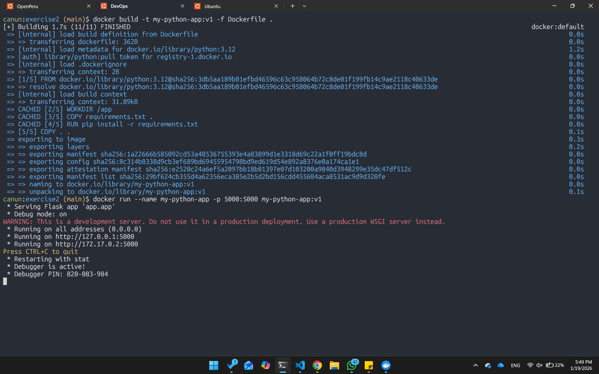
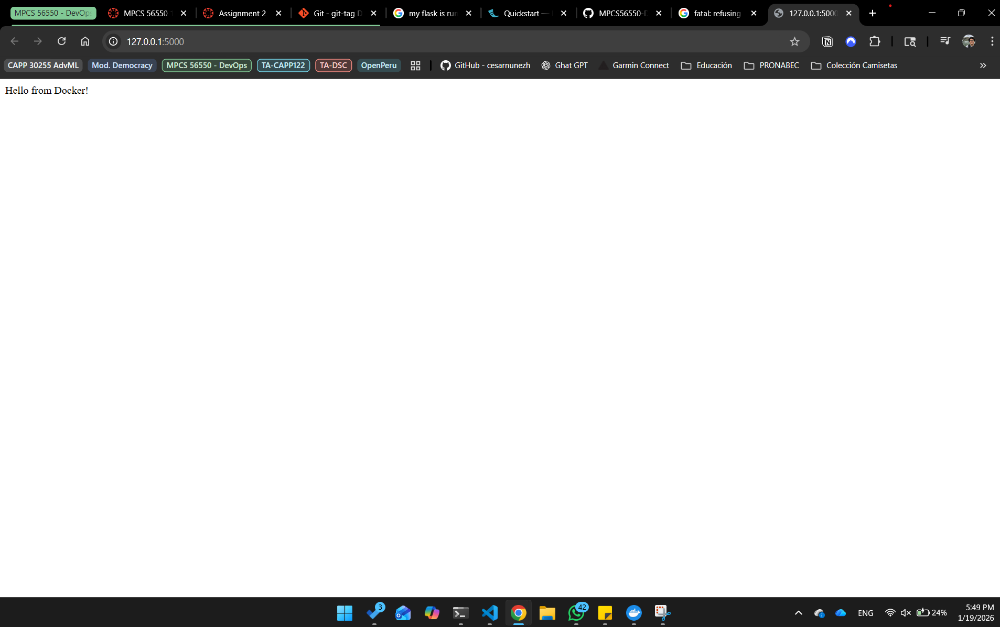
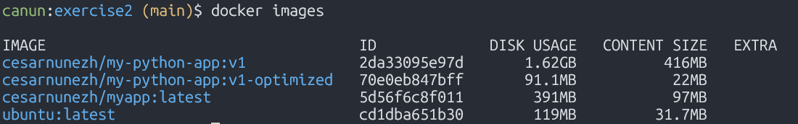
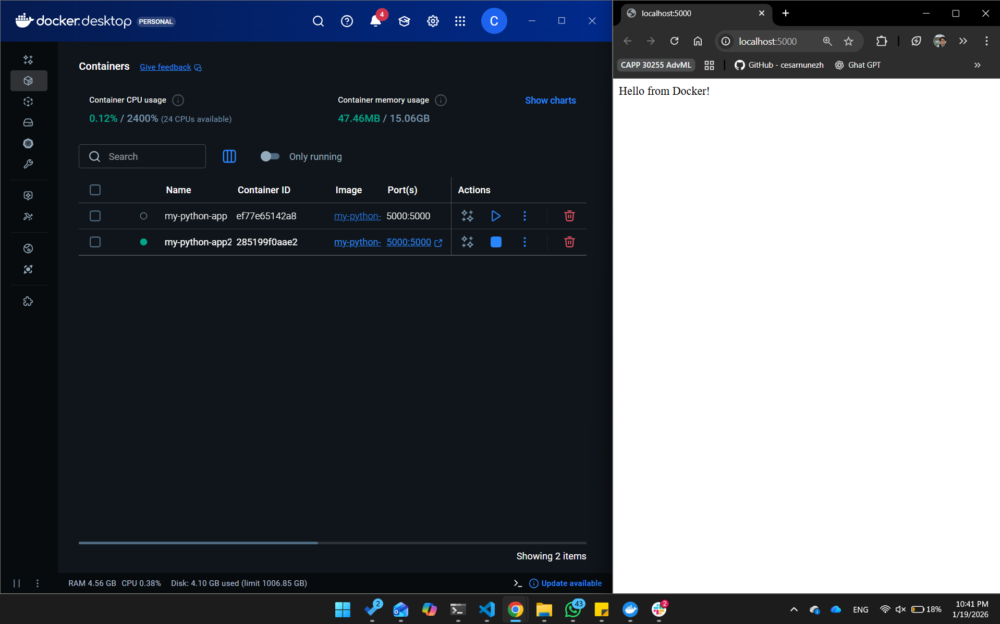
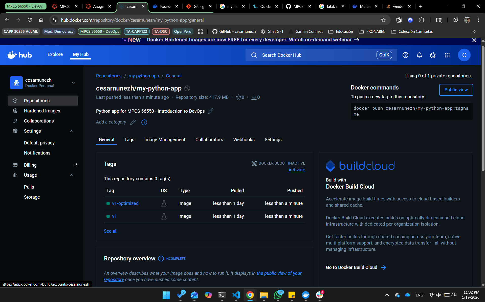

# DevOps Homework 2 - Winter 2026

**Student:** César Núñez  
**Date:** 01/19/2026

---


# Exercise 1: Basic Container Operations

## Task 1.1: Working with Pre-built Images
### Deliverable: 
- Screenshot of the nginx welcome page: 

- Terminal commands used:


```bash
# Run an nginx container in detached mode, mapping port 8080 on your host to port 80 in the container
docker run -d -p 8080:80 --name nginx nginx:trixie-perl

# Stop and remove the container
docker container stop nginx
docker container rm nginx

# List all images on your system
docker images
```

## Task 1.2: Container Interaction
### Deliverable: 
- Terminal session transcript
```
canun:homework2 (main)$ docker run -it --name ubuntu_ex1 ubuntu:latest
root@8907e845fa92:/# vim
bash: vim: command not found
root@8907e845fa92:/# echo 'Cesar Nunez - cnunezh' >> simple.txt
root@8907e845fa92:/# ls
bin  boot  dev  etc  home  lib  lib64  media  mnt  opt  proc  root  run  sbin  simple.txt  srv  sys  tmp  usr  var
root@8907e845fa92:/# exit
exit
canun:homework2 (main)$ docker restart ubuntu_ex1
ubuntu_ex1

canun:homework2 (main)$ docker start ubuntu_ex1
ubuntu_ex1

canun:homework2 (main)$ docker start -i  ubuntu_ex1
root@8907e845fa92:/# ls
bin  boot  dev  etc  home  lib  lib64  media  mnt  opt  proc  root  run  sbin  simple.txt  srv  sys  tmp  usr  var
```
- Explanation:
    With the command `docker run` we are creating the container from the image `ubuntu:latest` in a interactive way.
    Then when creating the file, we are modifying the running container, which then we restart it and the files created
    still exist in the container. This is because we are not creating from a new image, but from the previous container. 


# Exercise 2: Building Custom Images 
## Task 2.1: Simple Web Application
### Deliverable: 
- Source code: available at my GitHub [repo](https://github.com/cesarnunezh/MPCS56550-DevOps/tree/main/homework2/exercise2)
- Dockerfile: available [here](https://github.com/cesarnunezh/MPCS56550-DevOps/blob/main/homework2/exercise2/Dockerfile) but also here: 
```
# Use official Python image as base
FROM python:3.12

# Set working directory to /app
WORKDIR /app

# Copy requirements file and run pip install
COPY requirements.txt .
RUN pip install -r requirements.txt

# Copy application code
COPY . .

#Expose port 5000
EXPOSE 5000

#Set the startup command
CMD ["python", "-m", "app"]
```
- Docker build and run commands
```
docker build -t my-python-app:v1 -f Dockerfile .
docker run --name my-python-app -p 5000:5000 my-python-app:v1
```
- Proof of running application



## Task 2.2: Multi-stage Build
### Deliverable:
- Dockerfile: available [here](https://github.com/cesarnunezh/MPCS56550-DevOps/blob/main/homework2/exercise2/Dockerfile.multistage) but also here: 
```
# Stage 1 - Build Stage:
# Use python:3.11 
FROM python:3.11 AS stage1

# Set working directory to /app
WORKDIR /app

# Install build dependencies 
RUN apt-get update && apt-get install -y --no-install-recommends \
    build-essential gcc \
  && rm -rf /var/lib/apt/lists/*

# Copy requirements file and run pip install
COPY requirements.txt .
RUN pip install --prefix=/install -r requirements.txt

# Stage 2 - Runtime Stage:
# Use python:3.11-alpine (minimal Alpine-based Python image)
FROM python:3.11-alpine AS stage2

# Set working directory to /app
WORKDIR /app

# Copy the installed packages from the build stage
COPY --from=stage1 /install /usr/local

# Copy application code
COPY . .

#Expose port 5000
EXPOSE 5000

#Set the startup command
CMD ["python", "-m", "app"]
```
- Screenshots showing image size comparison:


- Written analysis explaining the size difference and benefits:
    The main reason of the size difference is that a multi-stage Dockerfile separates the build-time from the
    runtime. In that sense, we are using for runtime a subset of the build image that contains what is strictly 
    necessary for the application. The smaller image also impacts the speed of deployment.

- Verification that both images work identically
    - Single Stage: 
    - Multi Stage: 

## Task 2.3: Docker Hub Registry
### Deliverable:
- Screenshots of Docker Hub repository with pushed images


# Exercise 3: Docker Compose Multi-Container Application 
## Task 3.1: Web App with Database
### Deliverable:
- Complete application code: available [here](https://github.com/cesarnunezh/MPCS56550-DevOps/blob/main/homework2/exercise3)
- Docker-compose.yaml
```
services:
  backend:
    build:
      context: backend
      target: runtime
    restart: always
    env_file: .env
    ports:
      - "5000:5000"
    volumes:
      - todo-logs:/backend/logs
    depends_on:
      db:
        condition: service_healthy
    healthcheck:
      test: ["CMD", "python", "-c", "import urllib.request; urllib.request.urlopen('http://localhost:5000/').read()"]
      interval: 30s
      timeout: 10s
      retries: 5
      start_period: 20s
    networks:
      - backend_net
      - frontend_net

  db:
    image: mysql:8.0
    env_file: .env
    healthcheck:
      test: ["CMD", "mysqladmin" ,"ping", "-h", "localhost"]
      interval: 10s
      timeout: 5s
      retries: 10
      start_period: 20s
    volumes:
      - todo-db:/var/lib/mysql
      - ./db/init.sql:/docker-entrypoint-initdb.d/init.sql:ro
    expose:
      - 3306
      - 33060
    networks:
      - backend_net
    

  proxy:
    build: proxy
    restart: always
    env_file: .env
    ports:
      - "8080:80"
    depends_on: 
      backend:
        condition: service_healthy
    healthcheck:
      test: ["CMD", "wget", "-qO-", "http://localhost/"]
      interval: 30s
      timeout: 5s
      retries: 5
      start_period: 10s
    networks:
      - frontend_net

volumes:
  todo-db:
    driver: local
  todo-logs:
    driver: local
  

networks:
  backend_net: 
    internal: true
  frontend_net: {}
```