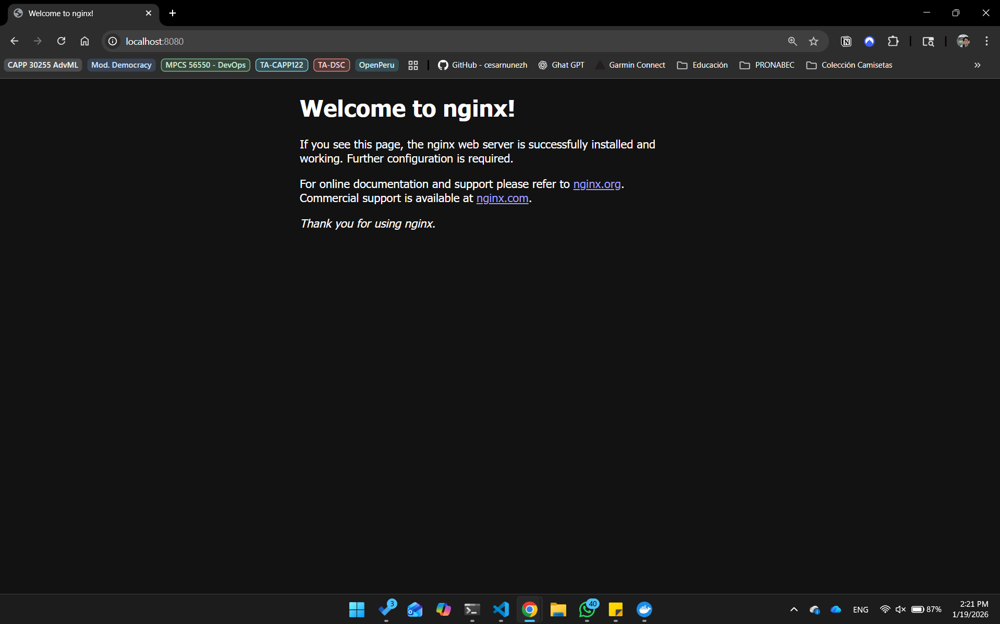
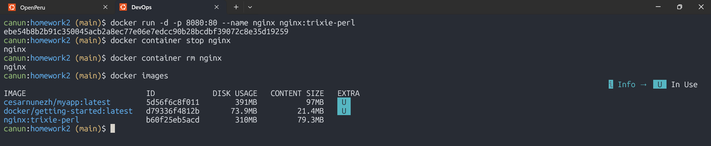

# DevOps Homework 2 - Winter 2026

**Student:** César Núñez  
**Date:** 01/19/2026

---


# Exercise 1: Basic Container Operations

## Task 1.1: Working with Pre-built Images
### Deliverable: 
- Screenshot of the nginx welcome page: 

- Terminal commands used:


```bash
# Run an nginx container in detached mode, mapping port 8080 on your host to port 80 in the container
docker run -d -p 8080:80 --name nginx nginx:trixie-perl

# Stop and remove the container
docker container stop nginx
docker container rm nginx

# List all images on your system
docker images
```

## Task 1.2: Container Interaction
### Deliverable: 
- Terminal session transcript
```
canun:homework2 (main)$ docker run -it --name ubuntu_ex1 ubuntu:latest
root@8907e845fa92:/# vim
bash: vim: command not found
root@8907e845fa92:/# echo 'Cesar Nunez - cnunezh' >> simple.txt
root@8907e845fa92:/# ls
bin  boot  dev  etc  home  lib  lib64  media  mnt  opt  proc  root  run  sbin  simple.txt  srv  sys  tmp  usr  var
root@8907e845fa92:/# exit
exit
canun:homework2 (main)$ docker restart ubuntu_ex1
ubuntu_ex1

canun:homework2 (main)$ docker start ubuntu_ex1
ubuntu_ex1

canun:homework2 (main)$ docker start -i  ubuntu_ex1
root@8907e845fa92:/# ls
bin  boot  dev  etc  home  lib  lib64  media  mnt  opt  proc  root  run  sbin  simple.txt  srv  sys  tmp  usr  var
```
- Explanation:
    With the command `docker run` we are creating the container from the image `ubuntu:latest` in a interactive way.
    Then when creating the file, we are modifying the running container, which then we restart it and the files created
    still exist in the container. This is because we are not creating from a new image, but from the previous container. 


# Exercise 2: Building Custom Images 
## Task 2.1: Simple Web Application
### Deliverable: 
```
docker build -t my-python-app:v1 -f Dockerfile .
```

## Task 2.2: Multi-stage Build
### Deliverable:

## Task 2.3: Docker Hub Registry
### Deliverable:


# Exercise 3: Docker Compose Multi-Container Application 
## Task 3.1: Web App with Database
### Deliverable:
