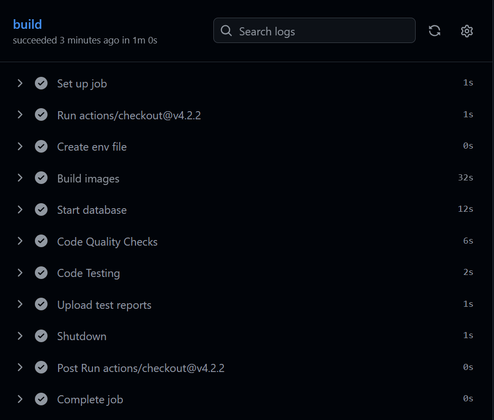
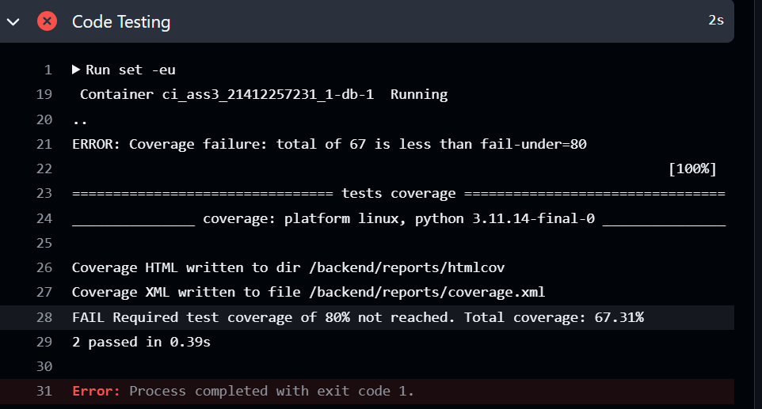
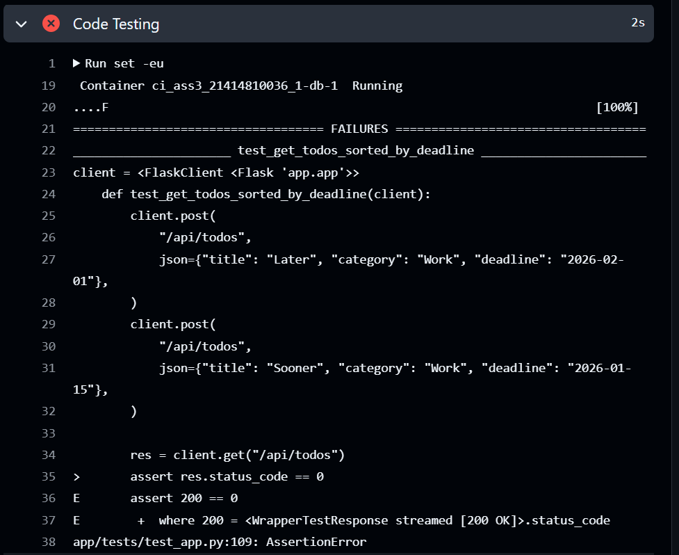
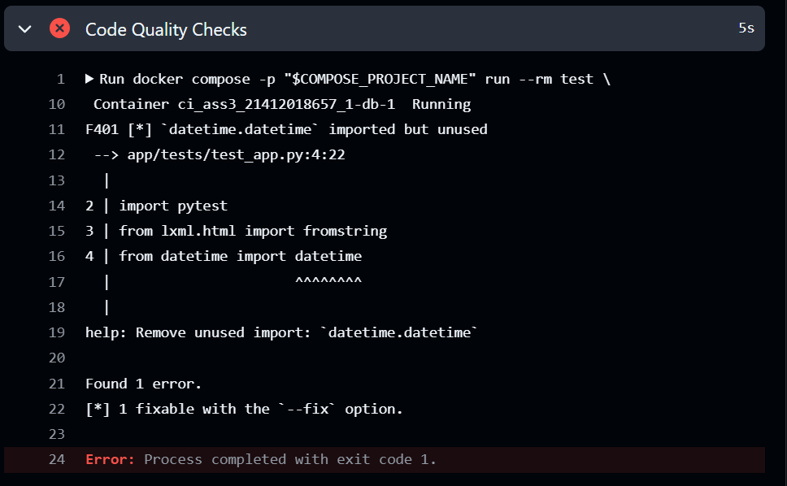

# DevOps Homework 3 - Winter 2026

**Student:** César Núñez  
**Date:** 01/26/2026

# Question 1
Compare and contrast at least three CI tools/platforms (e.g., Jenkins, GitHub Actions, GitLab CI, Azure DevOps, CircleCI). Create a comparison table that includes:
- Pricing model
- Ease of setup
- Integration capabilities
- Key features
- Best use cases

| CI Tool/Platform | Pricing model  | Ease of setup | Integration capabilities  | Key features  | Best case uses    |
|------------------|----------------|---------------|---------------------------|---------------|-------------------|
| Jenkins | Free and Open Source, but you need to pay for the machine it runs on | Setup is harder since you have to install Jenkins, manage plug ins (ex. Docker) which can take a lot of time | It has a lot of plug-ins that allows the integration with different services (GitHub, AWS, Docker, etc.) | Customizable pipelines, full control over the pipeline | When you need full control of the pipeline/infrastructure and custom behavior  |
| GitHub Actions | Free for public repositories. Private repositories have a monthly allowance of build minutes, then pay per minute. | Easier. Just need to create a YAML file that will runs CI automatically | Integration with GitHub features (PR, issues and releases) | Automatic checks for other GitHub features, YAML-based workflows | Small-medium projects hosted in GitHub |
| Azure DevOps | Free for individuals up to 1800 minutes per month in one Microsoft-hosted jobs and unlimited minutes for 1 self-hosted job. $40 per extra Microsoft-hosted CI/CD parallel job | More complex relative to GitHub Actions/Jenkins | Integrations with Azure services and supports external repos | CI/CD pipelines, enterprise grade access control  | Better for enterprises that use other Azure services |


# Question 2

### 1. CI Pipeline Configuration

- Complete pipeline configuration file (Jenkinsfile, .github/workflows/ci.yml, etc.): available [here](https://github.com/cesarnunezh/growth-planner/blob/main/.github/workflows/ci-ass3.yml) and also here:
```
name: ci_ass3

on:
  push:
    branches: [ "main" ]
  pull_request:
    branches: [ "main" ]

permissions:
  contents: read

jobs:
  build:
    runs-on: ubuntu-latest

    env:
      COMPOSE_PROJECT_NAME: ${{ github.workflow }}_${{ github.run_id }}_${{ github.run_attempt }}
      COVERAGE_FAIL_UNDER: "80"
  
    steps:
      - uses: actions/checkout@v4.2.2

      - name: Create env file
        run: |
          echo "${{ secrets.DEVOPS_ASS3 }}" > .env

      - name: Build images
        run: |
          docker compose -p "$COMPOSE_PROJECT_NAME" build db backend test

      - name: Start database
        run: |
          docker compose -p "$COMPOSE_PROJECT_NAME" up -d db

      - name: Code Quality Checks
        run : |
          docker compose -p "$COMPOSE_PROJECT_NAME" run --rm test \
            ruff check . --fix
          docker compose -p "$COMPOSE_PROJECT_NAME" run --rm test \
            ruff format --check .

      - name: Code Testing
        run : |
            set -eu
            mkdir -p reports

            docker compose -p "$COMPOSE_PROJECT_NAME" run --rm \
              -v "$PWD/reports:/backend/reports" \
              test sh -lc "
                pytest -q \
                  --junitxml=/backend/reports/junit.xml \
                  --cov=. \
                  --cov-report=xml:/backend/reports/coverage.xml \
                  --cov-report=html:/backend/reports/htmlcov \
                  --cov-fail-under=$COVERAGE_FAIL_UNDER
              "

      - name: Upload test reports
        if: always()
        uses: actions/upload-artifact@v4
        with:
          name: test-reports
          path: reports/
            
      - name: Shutdown
        if: always()
        run: |
          docker compose -p "$COMPOSE_PROJECT_NAME" down -v
```
- Pipeline must implement all 5 required tasks above


### 2. Application Source Code

- Working application with minimum 3 endpoints/features: available [here](https://github.com/cesarnunezh/growth-planner/blob/main/backend/app/app.py)
- Unit tests with minimum 5 test cases: available [here](https://github.com/cesarnunezh/growth-planner/blob/main/backend/app/tests/test_app.py)
- README file with project setup instructions: available [here](https://github.com/cesarnunezh/growth-planner/blob/main/README.md)
- All necessary configuration files: use this .env file (also in the README.md)
```.env
MYSQL_ROOT_PASSWORD=secret
MYSQL_DATABASE=todos
MYSQL_USER=todo_user
MYSQL_PASSWORD=todo_pass
```

### 3. Pipeline Evidence
- Screenshots or links showing successful pipeline runs: 
    - Example 1: [click here](https://github.com/cesarnunezh/growth-planner/actions/runs/21414616825) 
    - Example 2: [click here](https://github.com/cesarnunezh/growth-planner/actions/runs/21414493612) 

- Evidence that all 5 pipeline tasks execute successfully


- Screenshots showing pipeline failures (e.g., failed tests, code quality issues)
    - Coverage fail: [click here](https://github.com/cesarnunezh/growth-planner/actions/runs/21412257231)  
    - Test fail: [click here](https://github.com/cesarnunezh/growth-planner/actions/runs/21414810036)  
    - Code Quality fails: [click here](https://github.com/cesarnunezh/growth-planner/actions/runs/21412018657)  

# Question 3
Implementing a CI pipeline came with several challenges, especially during the initial setup phase. At the beginning of this homework, I chose Jenkins and was able to run it locally alongside my containerized application. While this helped me understande how CI tools work under the hood, I quickly ran into friction. The Jenkins documentation felt outdated and fragmented, and when I tried to configure GitHub triggers, the lack of clear and modern examples made debugging unnecessarily difficult. Much of my time was spent troubleshooting configuration issues rather than improving the pipeline itself, which made the process frustrating and inefficient.

Because of these challenges, I decided to switch to GitHub Actions. This change significantly improved my experience. The documentation was clear, well-maintained, and filled with practical examples, especially for Python and Docker-based applications (https://github.com/actions/starter-workflows/blob/main/ci/docker-image.yml). The availability of starter workflows made it easy to bootstrap a working CI pipeline with minimal configuration. Compared to Jenkins, GitHub Actions felt more intuitive and better integrated with the GitHub ecosystem, allowing me to focus on defining meaningful checks rather than fighting the tool.

Using CI has already changed how I think about software development. Going forward, I plan to include CI pipelines in all my projects from the start. Automatically running code quality checks and unit tests on every commit and push gives me faster feedback and more confidence in my changes. Instead of manually testing or worrying about breaking existing functionality, I can rely on CI to catch issues early. This encourages smaller, more frequent commits and reinforces better development habits overall.

Given more time, one improvement I would make to my pipeline is publishing Docker images to Docker Hub as part of the CI process. This would allow me to easily deploy and run my application in any environment without rebuilding images manually. Additionally, I would like to learn how to better integrate GitHub and Jenkins, as understanding how these tools can complement each other would be valuable for working in more complex or legacy CI/CD environments in the future.
