# DevOps Homework 4 - Winter 2026

**Student:** César Núñez  
**Date:** 02/04/2026

# Part 1: Environment Configuration
## Question 1

Each environment progressively trades flexibility for stability:
- Development is an envieronment optimized for speed.
- Integration is an environment designed for correctness
- Staging is an environment that aims to mimic reality
- Production is an environment that requires reliability and security

| Environment | Purpose/Characteristics | Data Management | Access Control & Security | Testing approaches |
|-------------|-------------------------|-----------------|---------------------------|--------------------|
| Development | Primary environment for writing, refactoring, and debugging code. Fast feedback loops, frequent changes, and tolerance for instability. Often local or ephemeral. | Mock data, synthetic data, or small local databases. No real user data. Data can be reset or discarded freely | Minimal access restrictions. Secrets usually mocked or injected via local env files. No production credentials. Static analysis tools may run locally | Unit tests, basic integration tests, regression tests. Focus on sunny and rainy paths. Static analysis (linting, formatting, basic security checks) |
| Integration | Combines code from multiple developers into shared branches. Triggered automatically by version control events (CI). Validates that components work together | Dedicated test databases derived from representative schemas or sanitized samples. No PII. Databases are reset between runs to ensure test isolation | Restricted access to CI systems. Secrets managed via CI secret stores. Limited credentials scoped only to test resources | Automated unit tests, integration tests, API tests. End-to-end tests at small scale. Focus on correctness and cross-component behavior |
| Staging | Pre-production environment that mirrors production as closely as possible. Used to validate performance, security, and deployment processes | Production-like datasets or large sanitized snapshots. Data volume and structure should resemble production without exposing sensitive data | Strong access controls similar to production. Secrets stored securely. Runtime security controls enabled. Penetration testing and vulnerability scanning allowed | Load testing, stress testing, security testing, compliance testing, user acceptance testing. Validation of deployment and rollback procedures |
|  Production | Live environment serving real users. Stability, availability, and security are the top priorities. Changes are carefully controlled and monitored | Real production data. Strict data governance, backups, retention policies, and disaster recovery plans. No destructive testing on live data | Strict role-based access control. Least-privilege permissions. Encrypted secrets, auditing, monitoring, and incident response processes in place | Limited testing only: smoke tests, health checks, canary releases, blue-green deployments. Monitoring, logging, and alerting replace heavy testing |

<div style="page-break-after: always;"></div>

# Part 2: Practical Implementation

## Question 2: Jenkins Agent Configuration
Set up at least one Jenkins agent (slave node), configure agent labels for specific tasks (e.g., testing, deployment), distribute pipeline workload across multiple agents, and document agent setup and configuration process.

#### Deliverables:
I was not able to create an agent. I'm running Jenkins in Docker and my app is running through a compose.yaml. I don't know how to connect them. I tried and received the following error:
```
SSHLauncher{host='172.19.40.47', port=22, credentialsId='2f70ef0b-e1a9-45c5-8970-07841904c71f', jvmOptions='', javaPath='', prefixStartSlaveCmd='', suffixStartSlaveCmd='', launchTimeoutSeconds=60, maxNumRetries=10, retryWaitTime=15, sshHostKeyVerificationStrategy=hudson.plugins.sshslaves.verifiers.KnownHostsFileKeyVerificationStrategy, tcpNoDelay=true, trackCredentials=true} [02/04/26 01:11:34] 

[SSH] Opening SSH connection to 172.19.40.47:22. 

Connection refused SSH Connection failed with IOException: "Connection refused", retrying in 15 seconds. There are 10 more retries left. 
Connection refused SSH Connection failed with IOException: "Connection refused", retrying in 15 seconds. There are 9 more retries left. 

Connection refused SSH Connection failed with IOException: "Connection refused", retrying in 15 seconds. There are 8 more retries left. 
Connection refused SSH Connection failed with IOException: "Connection refused", retrying in 15 seconds. There are 7 more retries left.
```
<div style="page-break-after: always;"></div>


## Question 3: Source Control Integration
Configure webhook triggers from your Git repository and set up branch-specific pipeline behavior based on your preferences (e.g., different stages for main vs feature branches).

#### Deliverables:
- Webhook configuration screenshots from Git repository:
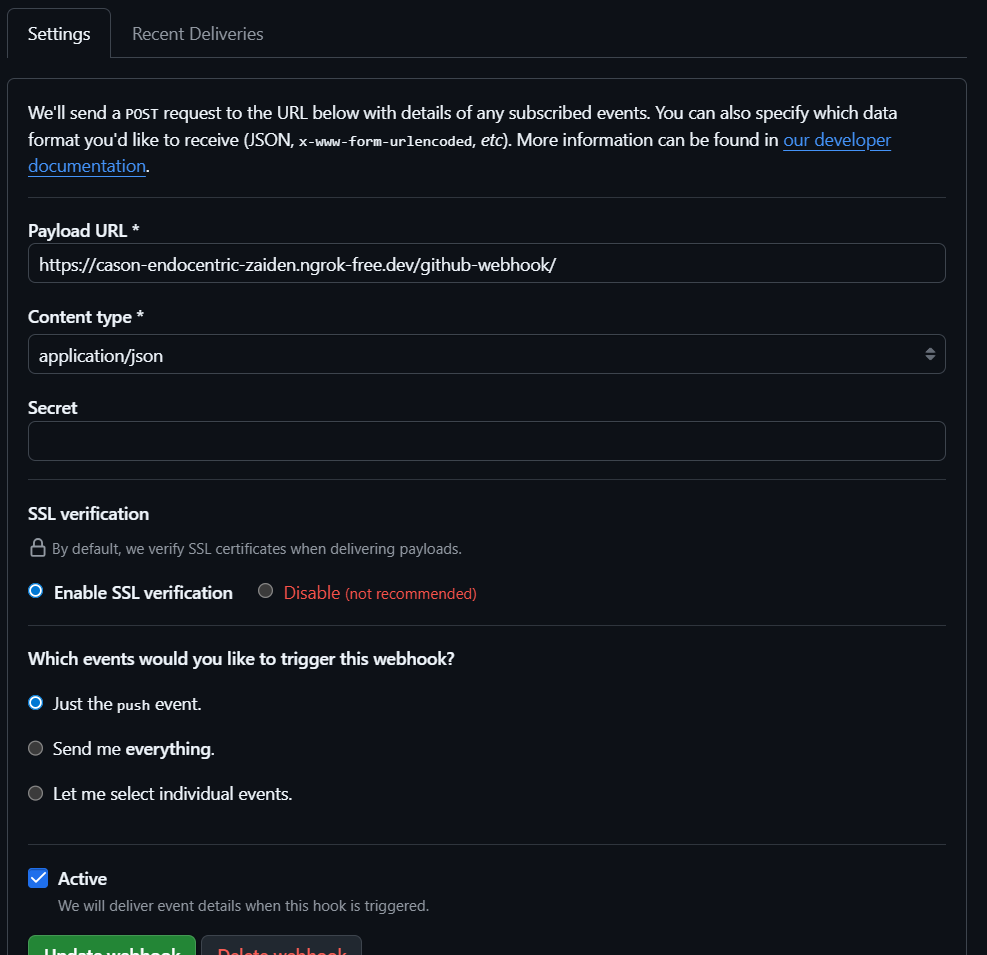
<div style="page-break-after: always;"></div>

- Jenkinsfile showing branch-specific pipeline logic: available [here](https://github.com/cesarnunezh/growth-planner/blob/main/Jenkinsfile). Also here:
```
    stage('Build') {
      steps {
        script {
          try {
            if (env.BRANCH_NAME == 'main'){
              sh '''
                # Build your actual app images (rubric build step)
                docker compose -p "$COMPOSE_PROJECT_NAME" build backend proxy

                # Verify images exist
                BACKEND_IMG="$(docker image ls \
                  --filter "label=com.docker.compose.project=$COMPOSE_PROJECT_NAME" \
                  --filter "label=com.docker.compose.service=backend" \
                  --format '{{.ID}}' | head -n 1)"
                PROXY_IMG="$(docker image ls \
                  --filter "label=com.docker.compose.project=$COMPOSE_PROJECT_NAME" \
                  --filter "label=com.docker.compose.service=proxy" \
                  --format '{{.ID}}' | head -n 1)"
                test -n "$BACKEND_IMG"
                test -n "$PROXY_IMG"
              '''
              } else {
              sh '''
                echo "This is not the main branch... Skip build"
              '''
              }
          } catch (error) {
              slackSend(
                  channel: '#all-devopstest',
                  color: '#ff0000',
                  message: "Failure @ Build - ${env.JOB_NAME} \nError details: ${error.getMessage()}"
              )
              throw error 
          }
        }
      }
    }
```
- Screenshot of webhook triggering pipeline runs:
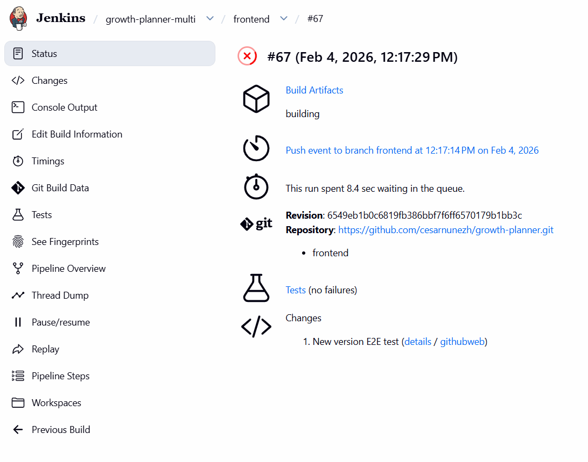
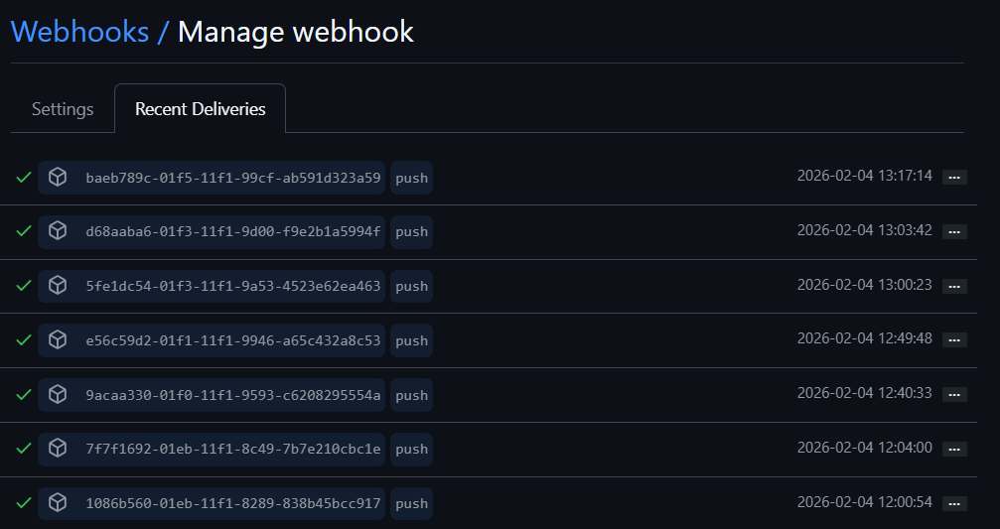

<div style="page-break-after: always;"></div>

## Question 4: Build and Package
Build application artifacts, version your builds using semantic versioning or build numbers, and store artifacts in Jenkins artifacts.

#### Deliverables:
- Build logs showing successful artifact creation:
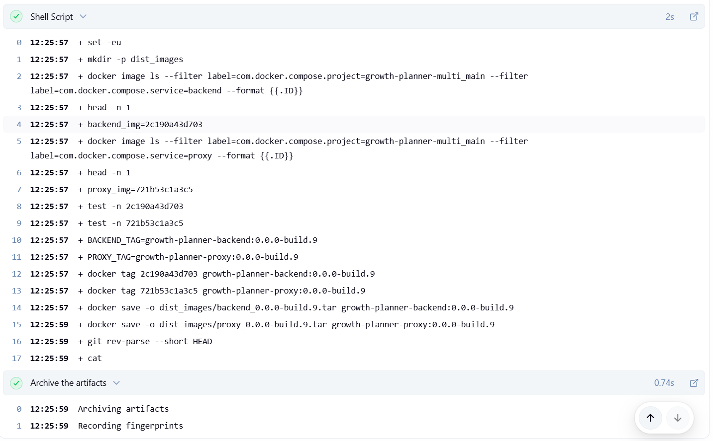
- Screenshots of versioned artifacts in Jenkins:
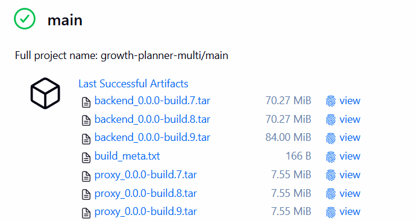
<div style="page-break-after: always;"></div>

- Build configuration in Jenkinsfile: available [here](https://github.com/cesarnunezh/growth-planner/blob/main/Jenkinsfile). Also here:
```
    stage('Build') {
      steps {
        script {
          try {
            if (env.BRANCH_NAME == 'main'){
              sh '''
                # Build your actual app images (rubric build step)
                docker compose -p "$COMPOSE_PROJECT_NAME" build backend proxy

                # Verify images exist
                BACKEND_IMG="$(docker image ls \
                  --filter "label=com.docker.compose.project=$COMPOSE_PROJECT_NAME" \
                  --filter "label=com.docker.compose.service=backend" \
                  --format '{{.ID}}' | head -n 1)"
                PROXY_IMG="$(docker image ls \
                  --filter "label=com.docker.compose.project=$COMPOSE_PROJECT_NAME" \
                  --filter "label=com.docker.compose.service=proxy" \
                  --format '{{.ID}}' | head -n 1)"
                test -n "$BACKEND_IMG"
                test -n "$PROXY_IMG"
              '''
              } else {
              sh '''
                echo "This is not the main branch... Skip build"
              '''
              }
          } catch (error) {
              slackSend(
                  channel: '#all-devopstest',
                  color: '#ff0000',
                  message: "Failure @ Build - ${env.JOB_NAME} \nError details: ${error.getMessage()}"
              )
              throw error 
          }
        }
      }
      post {
        success {
          script {
            if (env.BRANCH_NAME == 'main'){
              slackSend channel: "all-devopstest", color: "#43e094", message: "Success @ Build - ${env.JOB_NAME}"

              sh """
                set -eu
                mkdir -p "${ARTIFACT_DIR}"

                # find images by compose labels
                backend_img="\$(docker image ls \
                  --filter "label=com.docker.compose.project=${COMPOSE_PROJECT_NAME}" \
                  --filter "label=com.docker.compose.service=backend" \
                  --format '{{.ID}}' | head -n 1)"
                proxy_img="\$(docker image ls \
                  --filter "label=com.docker.compose.project=${COMPOSE_PROJECT_NAME}" \
                  --filter "label=com.docker.compose.service=proxy" \
                  --format '{{.ID}}' | head -n 1)"

                test -n "\$backend_img"
                test -n "\$proxy_img"

                # versioned tags (human friendly)
                BACKEND_TAG="growth-planner-backend:${APP_VERSION}"
                PROXY_TAG="growth-planner-proxy:${APP_VERSION}"

                docker tag "\$backend_img" "\$BACKEND_TAG"
                docker tag "\$proxy_img"   "\$PROXY_TAG"

                # versioned artifact files
                docker save -o "${ARTIFACT_DIR}/backend_${APP_VERSION}.tar" "\$BACKEND_TAG"
                docker save -o "${ARTIFACT_DIR}/proxy_${APP_VERSION}.tar"   "\$PROXY_TAG"

                # include a small metadata file too
                cat > "${ARTIFACT_DIR}/build_meta.txt" <<EOF
                version=${APP_VERSION}
                branch=${BRANCH_NAME}
                build_number=${BUILD_NUMBER}
                git_commit=\$(git rev-parse --short HEAD || true)
                EOF
              """
              archiveArtifacts artifacts: "${ARTIFACT_DIR}/**", fingerprint: true, onlyIfSuccessful: true
            } else {
              sh 'echo "This is not the development branch... Skip saving images"'
            }
          }
        }
      }
    }
```
<div style="page-break-after: always;"></div>

## Question 5: Code Quality Analysis
Integrate with SonarQube to analyze code for bugs, vulnerabilities, and code smells, and configure quality gates that prevent deployment if quality standards aren't met.

#### Deliverables:
- SonarQube project configuration screenshots: 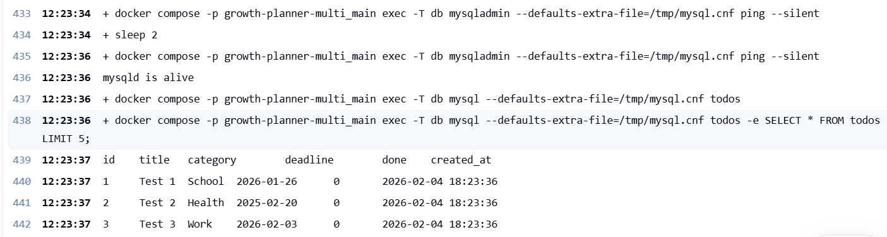
- SonarQube analysis reports with quality metrics: 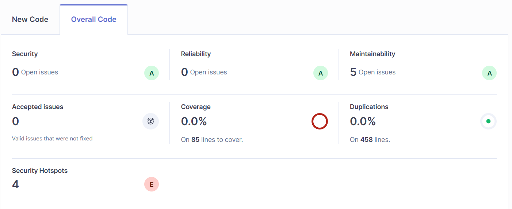
- Quality gate configuration and pipeline failure evidence when standards not met: 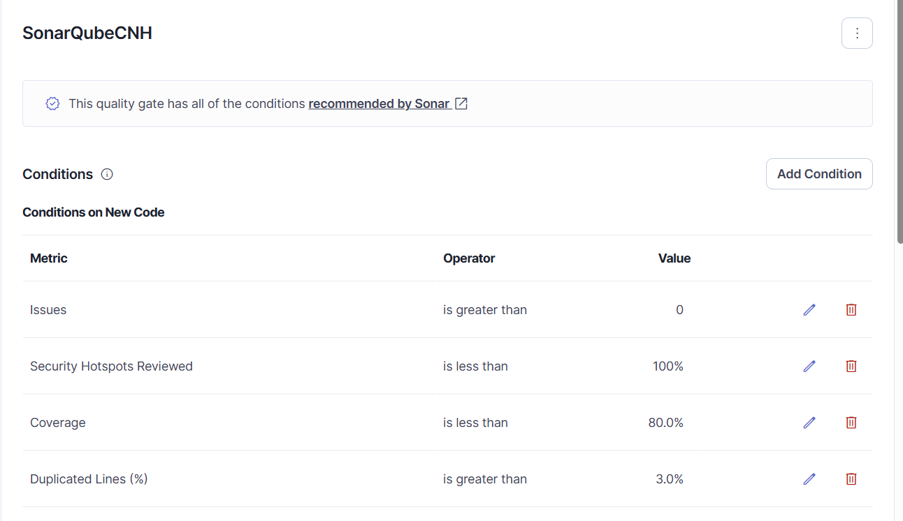

## Question 6: Database Management
Write the staging database schema to build staging database from scratch and seed staging database with test data.

#### Deliverables:
- Database schema scripts (SQL files or equivalent): available [here](https://github.com/cesarnunezh/growth-planner/blob/main/db/init.sql). Also here:
```sql
CREATE TABLE IF NOT EXISTS todos (
  id INT NOT NULL AUTO_INCREMENT,
  title VARCHAR(255) NOT NULL,
  category VARCHAR(64) NOT NULL,
  deadline DATE NOT NULL,
  done TINYINT(1) NOT NULL DEFAULT 0,
  created_at TIMESTAMP NOT NULL DEFAULT CURRENT_TIMESTAMP,
  PRIMARY KEY (id)
);

CREATE INDEX idx_todos_deadline ON todos (deadline);
CREATE INDEX idx_todos_category ON todos (category);
```
- Test data seeding scripts: available [here](https://github.com/cesarnunezh/growth-planner/blob/main/db/insert_test.sql). Also here:
```sql
INSERT INTO todos (title, category, deadline)
VALUES ("Test 1", "School", "2026-01-26");

INSERT INTO todos (title, category, deadline)
VALUES ("Test 2", "Health", "2025-02-20");

INSERT INTO todos (title, category, deadline)
VALUES ("Test 3", "Work", "2026-02-03");
```
- Screenshots showing successful database creation and seeding:


## Question 7: End-to-End Testing
Execute one end-to-end test scenario that simulates real user workflows to test user journey using testing frameworks like Selenium, Cypress, or Playwright, and generate test reports.

#### Deliverables:
- End-to-end test code/scripts:
    - EndToEndTest Class: [here](https://github.com/cesarnunezh/growth-planner/blob/main/backend/app/tests/e2e/e2e_test.py)
    - Pytest for E2E: [here](https://github.com/cesarnunezh/growth-planner/blob/main/backend/app/tests/e2e/test_todo_journey.py)
- Test execution screenshots:
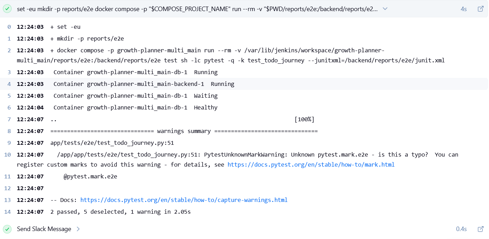
<div style="page-break-after: always;"></div>

- Generated test reports (HTML, XML, or similar format):
```xml
This XML file does not appear to have any style information associated with it. The document tree is shown below.
<testsuites name="pytest tests">
<testsuite name="pytest" errors="0" failures="0" skipped="0" tests="2" time="1.825" timestamp="2026-02-04T19:12:26.474911+00:00" hostname="f759f95eb097">
<testcase classname="app.tests.e2e.test_todo_journey" name="test_constructor" time="0.343"/>
<testcase classname="app.tests.e2e.test_todo_journey" name="test_user_journey" time="1.279"/>
...
</testsuite>
...
</testsuites>
```

## Question 8: Performance Testing
Execute a single load test using tools like JMeter, k6, or Artillery, test application performance under expected load, generate performance reports, and set performance thresholds that must be met.

#### Deliverables:
- Load test configuration files: available [here](https://github.com/cesarnunezh/growth-planner/blob/main/perf/k6_smoke.js)
- Performance test execution logs: available [here](https://cason-endocentric-zaiden.ngrok-free.dev/job/growth-planner-multi/job/main/9/artifact/perf_reports/k6_run.log). Also a sample here:
```

         /\      Grafana   /‾‾/  
    /\  /  \     |\  __   /  /   
   /  \/    \    | |/ /  /   ‾‾\ 
  /          \   |   (  |  (‾)  |
 / __________ \  |_|\_\  \_____/ 

     execution: local
        script: /perf/k6_smoke.js
        output: -

     scenarios: (100.00%) 1 scenario, 10 max VUs, 2m15s max duration (incl. graceful stop):
              * default: Up to 10 looping VUs for 1m45s over 3 stages (gracefulRampDown: 30s, gracefulStop: 30s)


running (0m01.0s), 01/10 VUs, 0 complete and 0 interrupted iterations
default   [   1% ] 01/10 VUs  0m01.0s/1m45.0s

running (0m02.0s), 01/10 VUs, 1 complete and 0 interrupted iterations
default   [   2% ] 01/10 VUs  0m02.0s/1m45.0s

running (0m03.0s), 01/10 VUs, 2 complete and 0 interrupted iterations
default   [   3% ] 01/10 VUs  0m03.0s/1m45.0s

running (0m04.0s), 02/10 VUs, 3 complete and 0 interrupted iterations
default   [   4% ] 02/10 VUs  0m04.0s/1m45.0s

running (0m05.0s), 02/10 VUs, 5 complete and 0 interrupted iterations
default   [   5% ] 02/10 VUs  0m05.0s/1m45.0s

running (0m06.0s), 02/10 VUs, 7 complete and 0 interrupted iterations
default   [   6% ] 02/10 VUs  0m06.0s/1m45.0s

running (0m07.0s), 03/10 VUs, 9 complete and 0 interrupted iterations
default   [   7% ] 03/10 VUs  0m07.0s/1m45.0s

running (0m08.0s), 03/10 VUs, 12 complete and 0 interrupted iterations
default   [   8% ] 03/10 VUs  0m08.0s/1m45.0s

running (0m09.0s), 03/10 VUs, 15 complete and 0 interrupted iterations
default   [   9% ] 03/10 VUs  0m09.0s/1m45.0s
```
- Performance reports with metrics and thresholds: available [here](https://cason-endocentric-zaiden.ngrok-free.dev/job/growth-planner-multi/job/main/9/artifact/perf_reports/k6_run.log). Also available here:
```
  â–ˆ THRESHOLDS 

    checks
    ✓ 'rate>0.99' rate=100.00%

    http_req_duration
    ✓ 'p(95)<500' p(95)=1.68ms

    http_req_failed
    ✓ 'rate<0.01' rate=0.00%


  â–ˆ TOTAL RESULTS 

    checks_total.......: 836     7.971877/s
    checks_succeeded...: 100.00% 836 out of 836
    checks_failed......: 0.00%   0 out of 836

    ✓ GET / returns 200

    HTTP
    http_req_duration..............: avg=1.02ms min=568.24µs med=923.02µs max=3.15ms p(90)=1.44ms p(95)=1.68ms
      { expected_response:true }...: avg=1.02ms min=568.24µs med=923.02µs max=3.15ms p(90)=1.44ms p(95)=1.68ms
    http_req_failed................: 0.00%  0 out of 836
    http_reqs......................: 836    7.971877/s

    EXECUTION
    iteration_duration.............: avg=1s     min=1s       med=1s       max=1s     p(90)=1s     p(95)=1s    
    iterations.....................: 836    7.971877/s
    vus............................: 1      min=1        max=10
    vus_max........................: 10     min=10       max=10

    NETWORK
    data_received..................: 7.2 MB 69 kB/s
    data_sent......................: 57 kB  542 B/s
```

## Question 9: Notification System
Configure Slack or email notifications for pipeline status, send notifications for successful deployments, and alert team members for pipeline failures with error details.

#### Deliverables:
- Notification configuration in Jenkins:
    - Configuration in Jenkins: 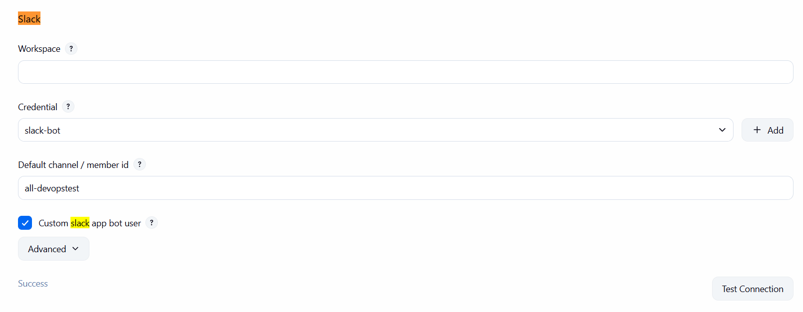
    - Jenkinsfile sample code:
    ```
    ## End to End Testing Stage
    stage('End to End Tests') {
      steps {
        script {
          try {
            sh '''
              set -eu
              mkdir -p reports/e2e

              docker compose -p "$COMPOSE_PROJECT_NAME" run --rm \
                -v "$PWD/reports/e2e:/backend/reports/e2e" \
                test sh -lc "pytest -q -k test_todo_journey" \
                  --junitxml=/backend/reports/e2e/junit.xml \
            '''
          } catch (error) {
              slackSend(
                  channel: '#all-devopstest',
                  color: '#ff0000',
                  message: "Failure @ End to End Tests - ${env.JOB_NAME} \nError details: ${error.getMessage()}"
              )
              throw error 
          }
        }
      }
      post {
        success {
            slackSend channel: "all-devopstest", color: "#43e094", message: "Success @ End to End Tests - ${env.JOB_NAME}"
        }
        always {
          junit 'reports/e2e/junit.xml'
          archiveArtifacts artifacts: 'reports/e2e/**', fingerprint: true
        }    
      }
    }       
    ```
- Screenshots of successful deployment notification

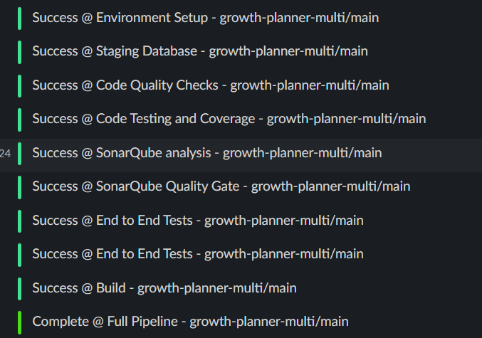
<div style="page-break-after: always;"></div>

- Screenshots of failure notifications with error details: This is an example of how the Slack notification plugin send a Failure message at Code Testing and Coverage Stage first, and then when solved send a Success message. 

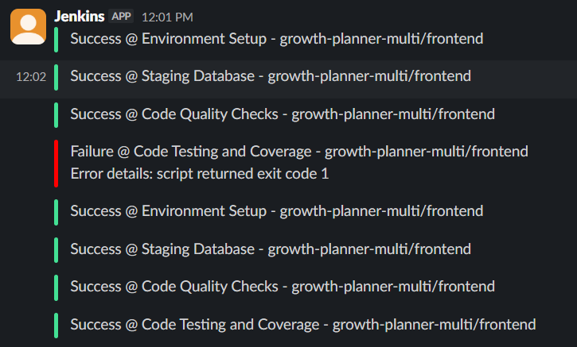