# DevOps Homework 5 - Winter 2026

**Student:** César Núñez  
**Date:** 02/12/2026

# Question 1: Compare and Contrast Deployment Strategies
Provide a comprehensive explanation of the following deployment strategies. For each strategy, include:
- How it works
- Advantages
- Disadvantages
- When to use it (use cases)

| Deployment Strategy | How it works | Advantages | Disadvantages | Use cases | Source |
|---------------------|--------------|------------|---------------|-----------|-----------|
| Recreate deployment | This strategy involves terminating all existing instances of the old release before creating instances of the new release. | Simplicity: It is the simplest deployment strategy since it just runs one version of the software at a time.  | Downtime: During the transition between old and new versions, there is a period where the application is not available for users.  | Application with a unique instance running. In that case it will make sense to delete it and create it completely with the new version. | https://medium.com/@muppedaanvesh/rolling-update-recreate-deployment-strategies-in-kubernetes-️-327b59f27202 |
| Rolling update        | This strategy implements a gradual rollout of new releases, instead of updating all instances at once, it does it with a subset of instances. | Reduced downtime: guarantees that a subset of instances of the application are always running in a stable version. Incremental rollout: Allow for a gradual introduction of the new version which makes it easier to identify and solve issues without affecting all users. | Complex rollback: Need to revert updates on individual instances which can lead to inconsistancies if not properly managed. Longer deployment time: as this strategy occurs incrementally, the complete deployment process can take longer compared to other strategies. | Web application with multiple instances running. With rolling updates the application will continue to serve users even during updates | https://octopus.com/devops/software-deployments/rolling-deployment/ https://medium.com/@muppedaanvesh/rolling-update-recreate-deployment-strategies-in-kubernetes-️-327b59f27202 |
| Blue-Green deployment | Runs two identical production environments where the blue refers to the 'old' and green to the 'new' version of the program. During the deployment you can continue serving users in the blue environment while testing the green one. Then add progressively traffic into the green environment, fix issues and fully migrate when the green environment is properly working. | Less downtime: by having two identical environments users experience minimal or no downtime during updates. Immediate rollback: In case of a problem with the new release, you can redirect traffic into the stable environment. | Resource overhead: Maintaining 2 identical environment requires higher costs. Complexity in database changes: if the new release involves significant database schema changes, you have to plan ahead with a data synchronization and migration strategies to avoid inconsistencies. Security: running 2 environments increases the attack surface. | As can be really costly, this will fit for small or medium applications where the ammount of users still manageable to work with two independent production environments, such as an early stage mobile app. | https://octopus.com/devops/software-deployments/blue-green-deployment/ |
| Canary deployment     | This strategy implements a rolling out deployment to a subset of users or serves, such that the first stage of deployment is on a small subset, test it and then roll it out progressively to the rest of the users/servers. | Risk mitigation: by deploying changes in small subset of servers, it's easy to find and address issues minimizing impact on users. Real-time feedback: provide immediate insights into the performance of new releases under real-world conditions. Cost-effectiveness: does not require a duplicated environment. | Complexity: requires sophisticated traffic management, monitoring and automated testing. Rollback complexity: relative to blue/green deployments, is more complex since requires to revert the version for a subset of users/servers. | New feature for an existing videogame or software in which you'd like to test it with a small subset of users. |https://octopus.com/devops/software-deployments/canary-deployment/ |
| A/B testing deployment | This strategy deploys simultaneously two versions of software to different user groups to compare some specific features and user response to those changes. This allow to make data-driven decisions about which versions should be fully deployed. | Optimizing User Experience: Allow to experiment with small changes that might impact users in a small and controlled setting. Data-Informed Decisions: reduce subjective opinions by providing concrete data for technical decisions by determining which variants of the software perform better | Potential False Positives: as it involves statistical analysis, there is a risk of incorrectly identify a variation as successful when it's actually due to chance. External factors: other factors might affect the results of the A/B testing and therefore the timing of the testing is important. | New payment interface for a online store | https://octopus.com/devops/software-deployments/#8-ab-testing https://www.enov8.com/blog/a-b-testing-the-good-the-bad/ |

# Question 2: Rolling Update Implementation
Create a complete Kubernetes deployment for a sample web application using minikube.

Requirements:
- Use nginx image (or any web server of your choice)
- Configure 3 replicas
- Implement rolling update strategy with:
  - maxSurge: 1
  - maxUnavailable: 1
- Include health checks:
  - Readiness probe
  - Liveness probe

### Deliverables:
- `rolling-update-deployment.yaml` - Complete deployment manifest: available [here](https://github.com/cesarnunezh/MPCS56550-DevOps/blob/main/homework5/q2/rolling-update-deployment.yaml).
- `rolling-update-service.yaml` - Service manifest to expose the deployment: available [here](https://github.com/cesarnunezh/MPCS56550-DevOps/blob/main/homework5/q2/rolling-update-service.yaml).
- `update-demo.sh` - Shell script demonstrating how to update the deployment to a new version: available [here](https://github.com/cesarnunezh/MPCS56550-DevOps/blob/main/homework5/q2/update-demo.sh).
- `screenshots/` folder containing [(available here)](https://github.com/cesarnunezh/MPCS56550-DevOps/tree/main/homework5/q2/screenshots):
  - `01-initial-deployment.png` - get deployments/pods showing initial state: 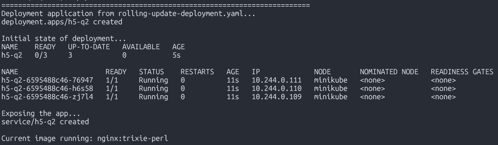
  - `02-update-in-progress.png` - rollout status during update: 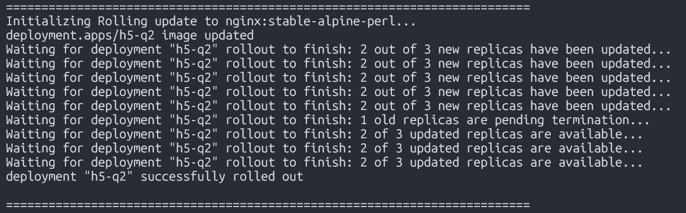
  - `03-update-completed.png` - get pods showing successful update: 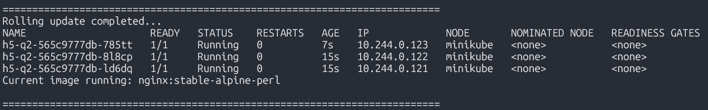
  - `04-rollback-executed.png` - rollout undo command and result: 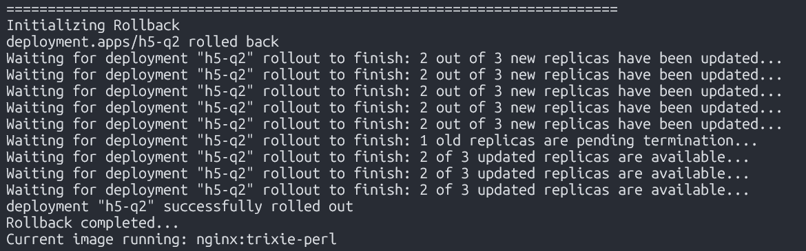
  - `05-service-endpoint.png` - curl or browser showing the service is accessible: 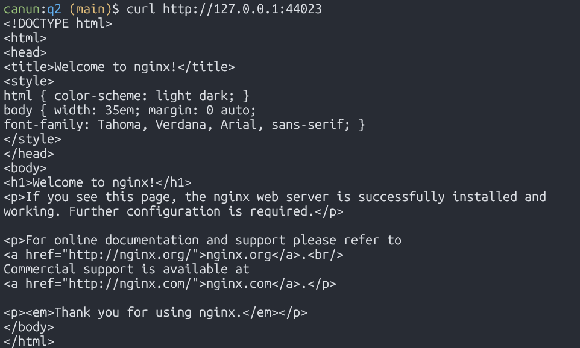

# Question 3: Blue-Green Deployment
Design and implement a complete blue-green deployment strategy for a web application using minikube.
Requirements:
- Create separate deployments for blue and green environments
- Each environment should have at least 2 replicas
- Implement a Service that can switch traffic between blue and green
- Document the complete switching process

### Deliverables:
- `blue-deployment.yaml` - Blue environment deployment: available [here](https://github.com/cesarnunezh/MPCS56550-DevOps/blob/main/homework5/q3/blue-deployment.yaml).
- `green-deployment.yaml` - Green environment deployment: available [here](https://github.com/cesarnunezh/MPCS56550-DevOps/blob/main/homework5/q3/green-deployment.yaml).
- `blue-green-service.yaml` - Service configuration: available [here](https://github.com/cesarnunezh/MPCS56550-DevOps/blob/main/homework5/q3/blue-green-service.yaml).
- `switch-traffic.sh` - Script to switch traffic from blue to green: available [here](https://github.com/cesarnunezh/MPCS56550-DevOps/blob/main/homework5/q3/switch-traffic.sh).
- `rollback.sh` - Script to rollback from green to blue: available [here](https://github.com/cesarnunezh/MPCS56550-DevOps/blob/main/homework5/q3/rollback.sh).
- `screenshots/` folder containing [(available here)](https://github.com/cesarnunezh/MPCS56550-DevOps/tree/main/homework5/q3/screenshots):
  - `01-blue-deployment.png` - showing blue deployment running: 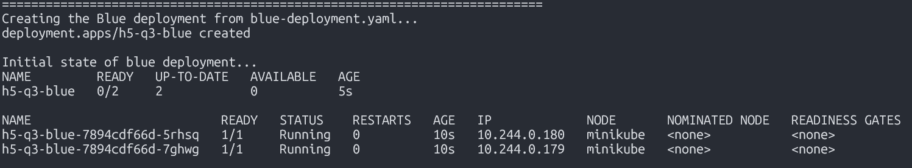
  - `02-green-deployment.png` - showing both blue and green running: 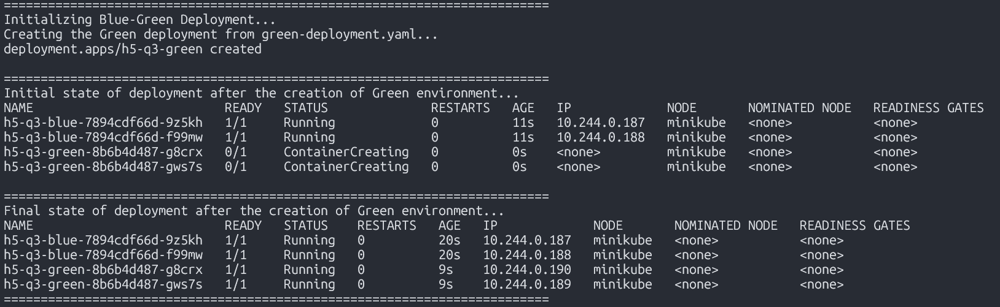
  - `03-service-pointing-blue.png` - describe service showing blue selector: 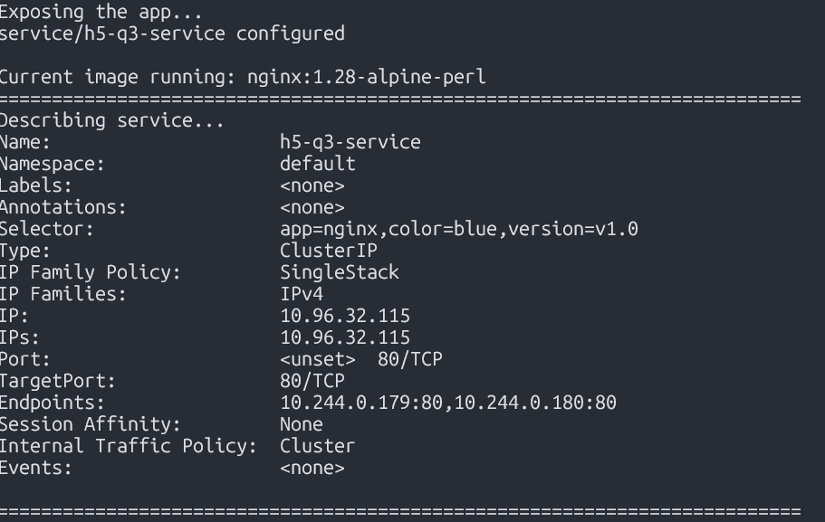
  - `04-switch-to-green.png` - commands switching service to green: 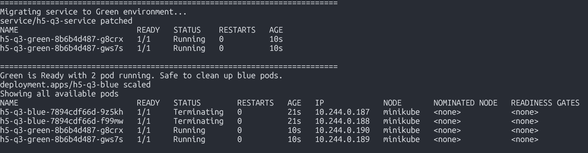
  - `05-service-pointing-green.png` - describe service showing green selector: 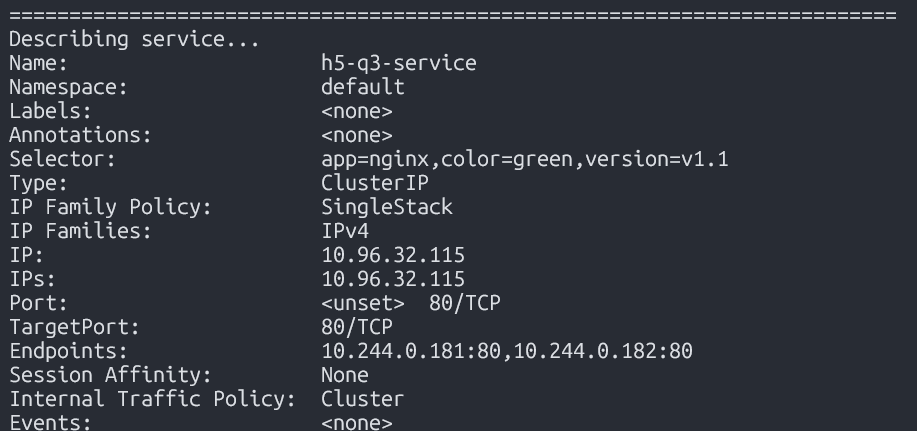
  - `06-rollback-to-blue.png` - Execution of rollback script and verification: 

# Question 4: Canary Deployment
Implement a canary deployment strategy that gradually rolls out a new version using minikube.

Requirements:
- Deploy a stable version (v1) and a canary version (v2)
- Route approximately 20% of traffic to canary (v2)
- Route approximately 80% of traffic to stable (v1)
- Provide a method to gradually increase traffic to canary

#### Deliverables:
- `stable-deployment.yaml` - Stable version deployment: available [here](https://github.com/cesarnunezh/MPCS56550-DevOps/tree/main/homework5/q4/stable-deployment.yaml)
- `canary-deployment.yaml` - Canary version deployment: available [here](https://github.com/cesarnunezh/MPCS56550-DevOps/tree/main/homework5/q4/canary-deployment.yaml)
- `stable-service.yaml` - Service for stable deployment: available [here](https://github.com/cesarnunezh/MPCS56550-DevOps/tree/main/homework5/q4/stable-service.yaml)
- `canary-service.yaml` - Service for canary deployment: available [here](https://github.com/cesarnunezh/MPCS56550-DevOps/tree/main/homework5/q4/canary-service.yaml)
- `canary-ingress.yaml` - Ingress configuration for traffic splitting: available [here](https://github.com/cesarnunezh/MPCS56550-DevOps/tree/main/homework5/q4/canary-ingress.yaml)
- `canary-promotion.sh` - Script to gradually increase traffic to canary: available [here](https://github.com/cesarnunezh/MPCS56550-DevOps/tree/main/homework5/q4/canary-promotion.sh)
- `screenshots/` folder containing [(available here)](https://github.com/cesarnunezh/MPCS56550-DevOps/tree/main/homework5/q4/screenshots):
  - `01-stable-deployment.png` - showing stable deployment running: 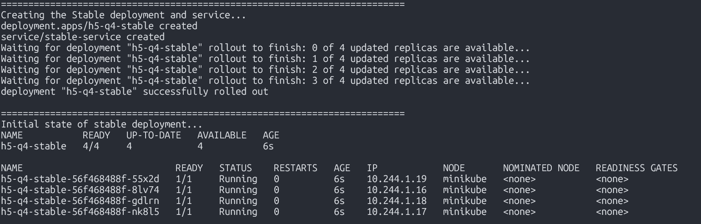
  - `02-canary-deployment.png` - showing both stable and canary running: 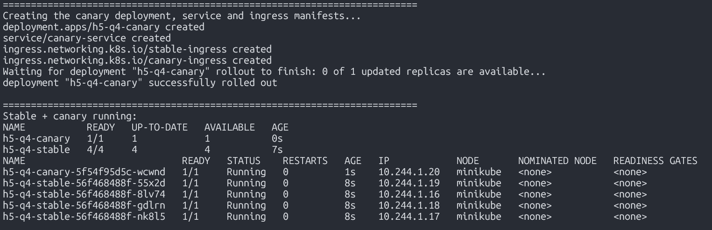
  - `03-traffic-split-20-80.png` - describe showing initial traffic split: 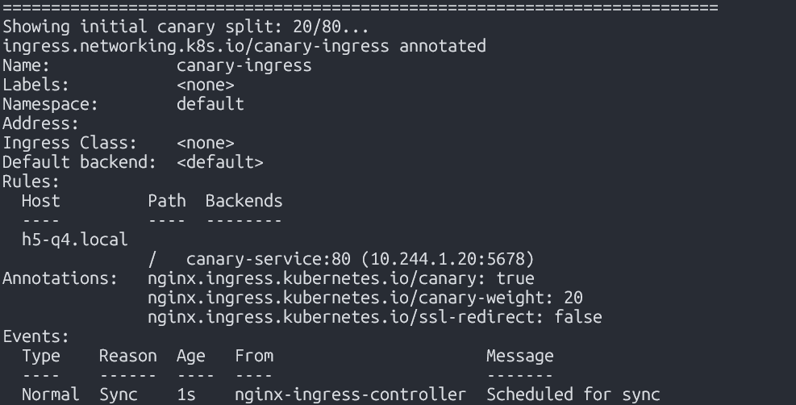
  - `04-traffic-test.png` - Multiple curl requests showing ~20% going to canary: 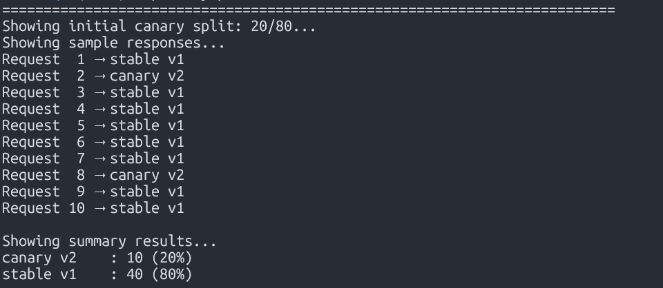
  - `05-promotion-50-50.png` - After promotion showing 50/50 traffic split: 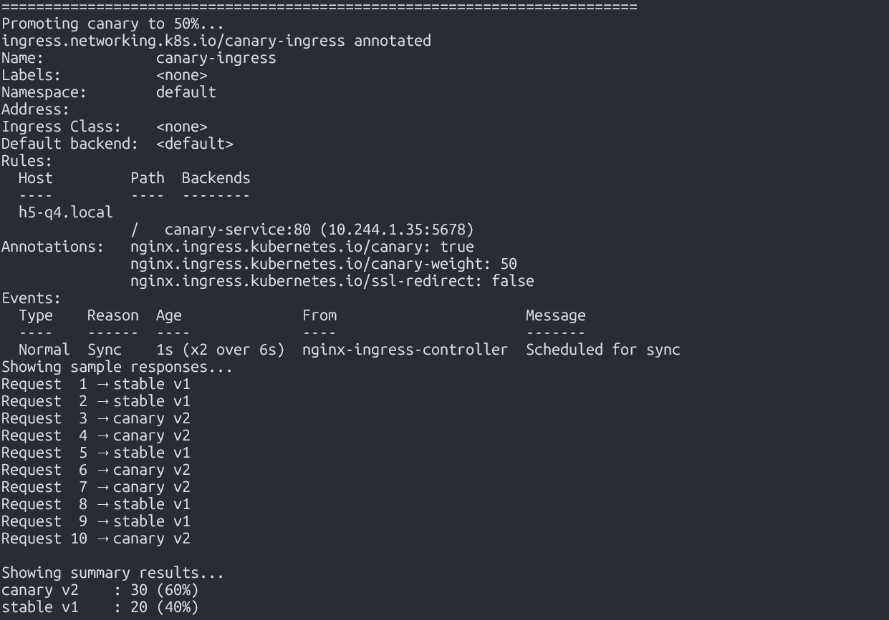
  - `06-promotion-100.png` - Final state with 100% traffic to canary: 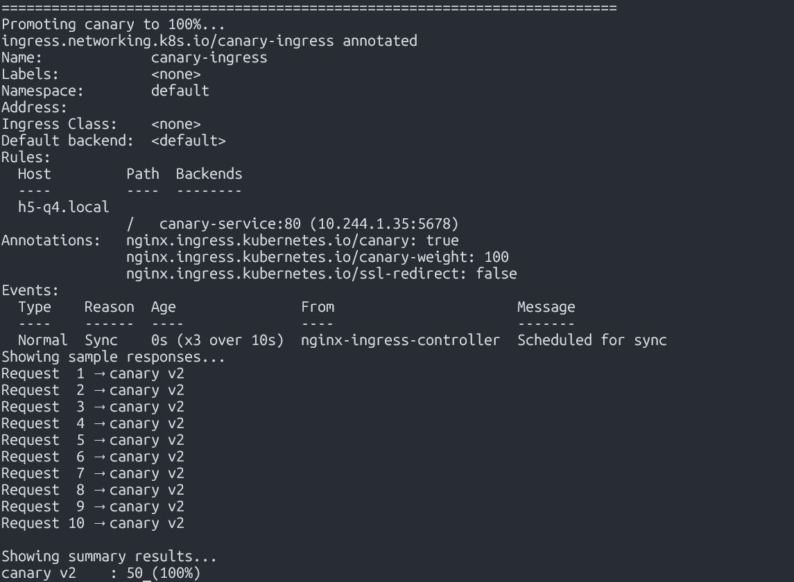